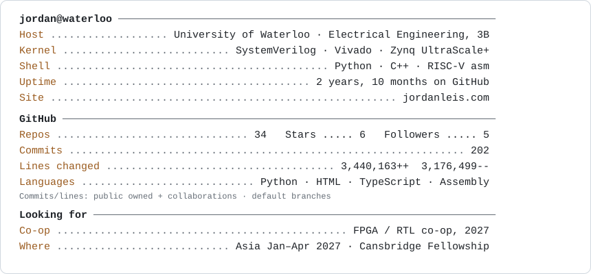

<picture>
  <source media="(prefers-color-scheme: dark)" srcset="assets/hello-dark.svg">
  
</picture>

### `whoami`

<picture>
  <source media="(prefers-color-scheme: dark)" srcset="assets/neofetch-dark.svg">
  
</picture>

### `cat contact.json`

```json
{
  "looking_for": "FPGA / RTL co-op, 2027",
  "where": "Asia, Jan–Apr 2027 (Cansbridge Fellowship)",
  "email": "jordan.jay.leis@gmail.com",
  "linkedin": "linkedin.com/in/jordan-leis",
  "site": "jordanleis.com",
  "resume": "https://drive.google.com/file/d/1jHbSPjZX3hLAVGLmC30Kj_MwDdtXkR9Z/view?usp=sharing"
}
```

[Email](mailto:jordan.jay.leis@gmail.com) · [LinkedIn](https://www.linkedin.com/in/jordan-leis/) · [Website](https://jordanleis.com) · [Résumé](https://drive.google.com/file/d/1jHbSPjZX3hLAVGLmC30Kj_MwDdtXkR9Z/view?usp=sharing)
